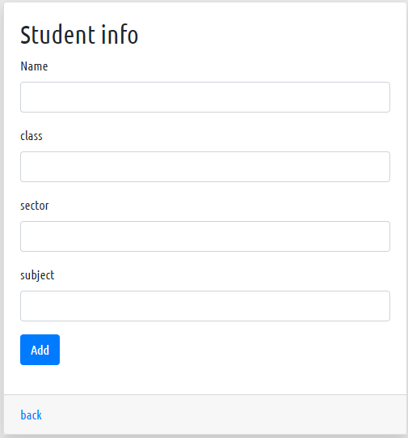
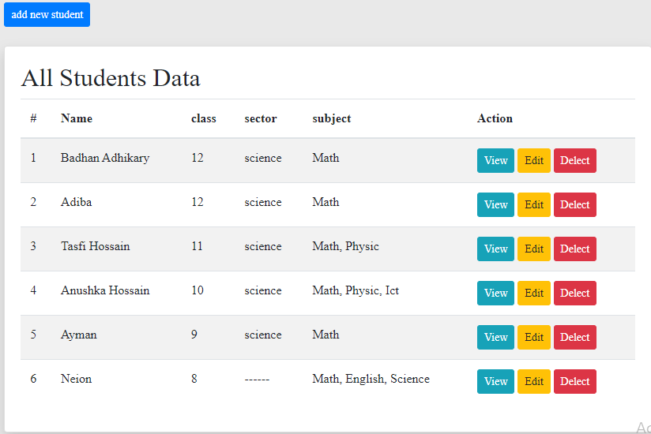
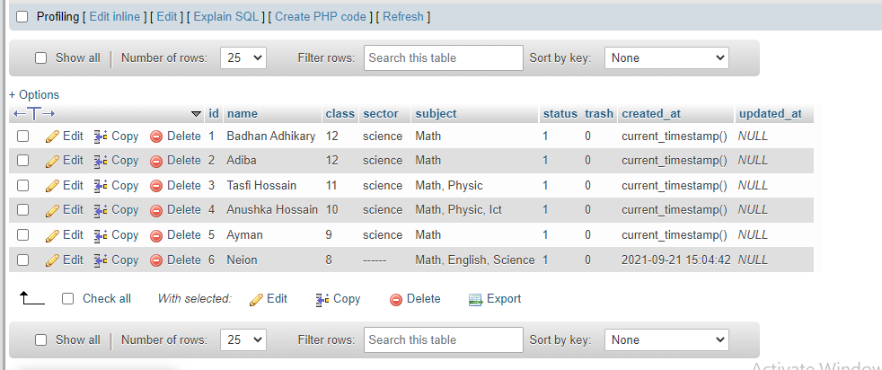

## Data collection (Mysql)




#### Our project features
-get data from input field
-sent it into dashboard
-and rearange it in browser
-its a musql project

```php


<?php
include_once "autoload.php";
?>

<?php 

	$connector= new mysqli('localhost', 'root', '', 'profile');
	

?>


<!DOCTYPE html>
<html lang="en">

<head>
	<meta charset="UTF-8">
	<title>SignUp</title>
	<!-- ALL CSS FILES  -->
	<link rel="stylesheet" href="assets/css/bootstrap.min.css">
	<link rel="stylesheet" href="style.css">
	<link rel="stylesheet" href="assets/css/responsive.css">
</head>

<body>

<div class="wrap-table" style="width: 60%; margin:20px auto 0px;">
<a class="btn btn-sm btn-primary" href="create.php">add new student</a>
<br>
<br>
	<div class="card shadow">
		<div class="card-body">
			<h2>All Students Data</h2>
			<table class="table table-striped">
				<thead>
					<tr>
						<th>#</th>
						<th>Name</th>
						<th>class</th>
						<th>sector</th>
						<th>subject</th>
						
						<th>Action</th>
					</tr>
				</thead>
				<tbody>

					<?php 
					$sql= "SELECT * FROM students";
					$data= $connector-> query($sql);
					$i=1;
					while ($ft= $data-> fetch_object()) :
						
					
					
					?>


					<tr>
						<td><?php echo $i; $i++ ?></td>
						<td><?php echo $ft->name ?></td>
						<td><?php echo $ft->class ?></td>
						<td><?php echo $ft->sector ?></td>
						<td><?php echo $ft->subject ?></td>
						
						<td>
							<a class="btn btn-sm btn-info" href="#">View</a>
							<a class="btn btn-sm btn-warning" href="#">Edit</a>
							<a class="btn btn-sm btn-danger" href="#">Delect</a>
						</td>

					</tr>
					<?php endwhile ?>
				</tbody>
			</table>
		</div>
	</div>
</div>


	<!-- JS FILES  -->
	<script src="assets/js/jquery-3.4.1.min.js"></script>
	<script src="assets/js/popper.min.js"></script>
	<script src="assets/js/bootstrap.min.js"></script>
	<script src="assets/js/custom.js"></script>
</body>

</html>

----------------------------------------------------------
<?php 
include_once "autoload.php";
?>

<?php 
$connector= new mysqli('localhost', 'root', '', 'profile');


?>


<!DOCTYPE html>
<html lang="en">

<head>
	<meta charset="UTF-8">
	<title>SignUp</title>
	<!-- ALL CSS FILES  -->
	<link rel="stylesheet" href="assets/css/bootstrap.min.css">
	<link rel="stylesheet" href="assets/css/style.css">
	<link rel="stylesheet" href="assets/css/responsive.css">
</head>

<body>

<?php 

if (isset($_POST['add'])) {
	$name= $_POST['name'];
	$class= $_POST['class'];
	$sector= $_POST['sector'];
	$subject= $_POST['subject'];
	if (empty($name) || empty($class)) {
		$mgs= validation('All fields are require!');
	} else {
		$msql= "INSERT INTO students (name, class, sector, subject) VALUES ('$name', '$class', '$sector', '$subject')";
		$connector-> query($msql);
		 

		$mgs=validation('Successfully Add', 'success');
	}
	
}


?>

			<!--form area-->

			<div class="wrap shadow">
				<div class="card">
					<div class="card-body">
						<h2>Student info</h2>
						<?php 
						if (isset($mgs)) {
							echo $mgs;
						}
						
						?>

						<form action="" method="POST" enctype="multipart/form-data">
							<div class="form-group">
								<label for="">Name</label>
								<input name="name" class="form-control" type="text">
							</div>

							<div class="form-group">
								<label for="">class</label>
								<input name="class" class="form-control" type="text">
							</div>

							<div class="form-group">
								<label for="">sector</label>
								<input name="sector" class="form-control" type="text">
							</div>

							<div class="form-group">
								<label for="">subject</label>
								<input name="subject" class="form-control" type="text">
							</div>

							<div class="form-group">
								
								<input name="add" class="btn btn-md btn-primary" type="submit" value="Add">

							</div>

						</form>
						
					</div>
					<div class="card-footer">
						<a href="index.php">back</a>
					</div>
				</div>
				
			</div>


	<!-- JS FILES  -->
	<script src="assets/js/jquery-3.4.1.min.js"></script>
	<script src="assets/js/popper.min.js"></script>
	<script src="assets/js/bootstrap.min.js"></script>
	<script src="assets/js/custom.js"></script>
</body>

</html>
```